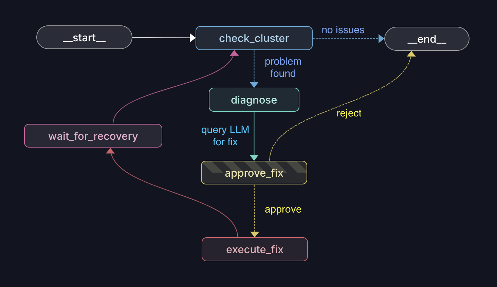

# Local K8s DevOps Agent

This is my local AI agent setup that can run durable and fully traceable devOps agent workflows to help troubleshoot and manage my K8S clusters, using a MCP server as the control plane. Compared to using an LLM or agent harness to execute pure bash commands in the terminal, this approach has the added benefit of full audit trails and explicit approvals, by using an orchestration layer provided by Hatchet. Also onboarding is much faster, compared to traditional dashboards like Flowise or Dify, as the MCP interface hides all the complexity behind natural language interactions.

### Features

- **Full K8s agent self-correcting loop** — check cluster, diagnose, execute fixes, verify, retry until exhausted
- **Human-in-the-loop approval** — agent pauses before every fix (unless for safe read-only checks) and waits for approval
- **Direct K8s tools** — individual MCP tools for checking pods, logs, deployments, events, kubectl, and more through chat interface
- **Scheduled nightly runs** — daily checks at 2 AM with optional push notifications when issues are found
- **Durable execution** — runs survive crashes, retry from last checkpoint, stop and resume at any point
- **Traceability** — full logging from every agent run, every LLM call and bash command is recorded in Hatchet

---

## Agent Graph Overview



- **check_cluster** — scans pods, deployments, nodes, events for problems
- **diagnose** — LLM analyzes cluster state and proposes a kubectl command
- **approve_fix** — pauses for human approval (skips if command is read-only)
- **execute_fix** — runs the approved kubectl command
- **verify_fix** — polls cluster until healthy or timeout
- **decide** — done (END), or retry (back to START > check_cluster)

## Quick Start

Prerequisites: Python 3.12+, Docker, [Just](https://github.com/casey/just)

```bash
git clone <repo>
cd hatchet-mcp
cp .env.example .env   # fill in all required env vars
just start              # Hatchet server - http://localhost:8888
just worker             # start the Hatchet worker
```

### MCP Configuration

| Tool | What it does |
|---|---|
| `k8s_inspect` | List pods, describe, logs, events, exec, problem pods |
| `k8s_run_agent` | Run the autonomous devops agent with a task prompt |
| `k8s_resume` | Approve/reject fixes, list/check/cleanup HITL threads |
| `k8s_exec_kubectl` | Raw kubectl commands if needed |

Add this to your LLM client's MCP config:

```json
{
  "mcpServers": {
    "k8s-devops": {
      "command": "uv",
      "args": ["run", "python", "/ABSOLUTE/PATH/TO/src/mcp/k8s_server.py"]
    }
  }
}
```

## Local Development

```bash
just lint               # ruff check + basedpyright
just test               # run tests
just dev                # LangGraph Studio (visual graph debugger)
```

## Acknowledgments

Built with [LangGraph](https://github.com/langchain-ai/langgraph) for agent orchestration, [Hatchet](https://github.com/hatchet-dev/hatchet) for durable execution, and the [Model Context Protocol](https://github.com/modelcontextprotocol) for the tool interface. Kubernetes cluster interactions use the [Kubernetes Python client](https://github.com/kubernetes-client/python).

## License

[MIT](LICENSE)
